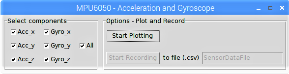
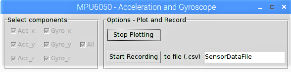
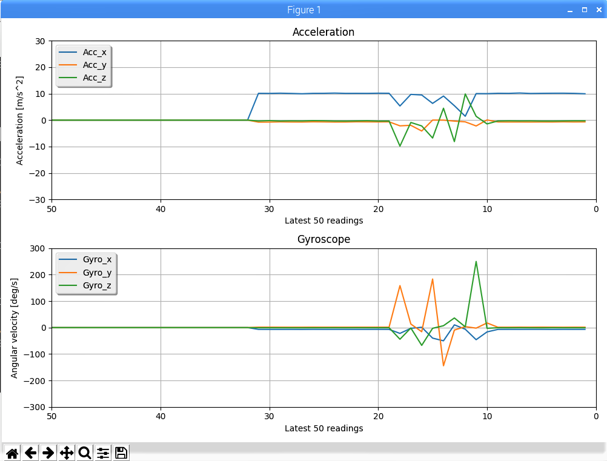

# mpu6050-data-recording-visualization-tool
A GUI tool for plotting and recording MPU-6050 digital accelerometer and gyroscope readings on a Raspberry Pi

## Programming Language: 
Python 3

## Dependencies: 
Following packages have to be installed on Raspberry Pi.

1. python-smbus package
```
sudo apt install python-smbus
```
2. mpu6050-raspberrypi package
```
pip install mpu6050-raspberrypi
```

## Screenshots:
<p align="center">
  
  
  
  
  
</p>
